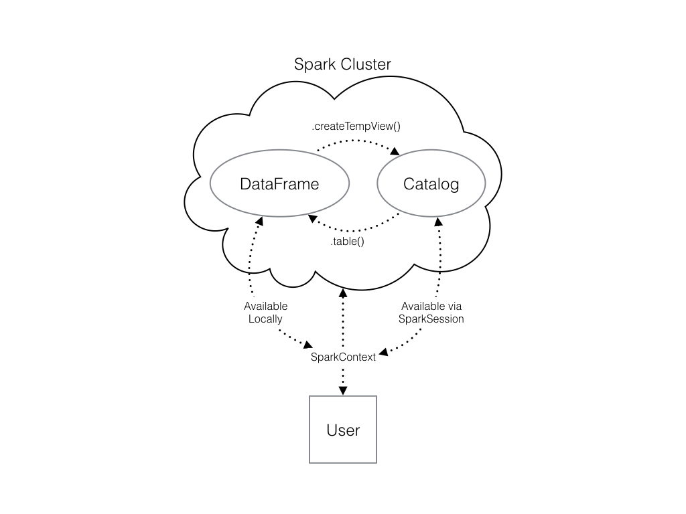

# Using Spark in Python

## SparkContext

Creating the connection is as simple as creating an instance of the SparkContext class. The class constructor takes a few optional arguments that allow you to specify the attributes of the cluster you're connecting to.

An object holding all these attributes can be created with the SparkConf() constructor. Take a look at the [documentation](http://spark.apache.org/docs/latest/configuration.html#available-properties) for all the details!

## Using DataFrames

The Spark DataFrame is a feature that allows you to create and work with DataFrame objects. These DataFrames are actually RDDs of Row objects, where each Row object is structured data, such as a tuple. Spark DataFrames allow you to interface with DataFrames from other languages, such as R and Python. You can also use SQL to query it!

The Spark DataFrame was designed to behave a lot like a SQL table (a table with variables in the columns and observations in the rows). Not only are they easier to understand, DataFrames are also more optimized for complicated operations than RDDs.

To start working with Spark DataFrames, you first have to create a *SparkSession* object from your *SparkContext*. You can think of the *SparkContext* as your connection to the cluster and the
*SparkSession* as your interface with that connection.

## Creating a SparkSession - 1

We've already created a *SparkSession* for you called *spark*, but what if you're not sure there already is one? Creating multiple *SparkSessions* and *SparkContexts* can cause issues, so it's best practice to use the *SparkSession.builder.getOrCreate()* method. This returns an existing *SparkSession* if there's already one in the environment, or creates a new one if necessary!

## Viewing tables - 2

Once you've created a *SparkSession*, you can start poking around to see what data is in your cluster!

Your *SparkSession* has an attribute called *catalog* which lists all the data inside the cluster. This attribute has a few methods for extracting different pieces of information.

One of the most useful is the *.listTables()* method, which returns the names of all the tables in your cluster as a list.

## Are you query-ious? - 3

One of the advantages of the DataFrame interface is that you can run SQL queries on the tables in your Spark cluster. 

Running a query on this table is as easy as using the *.sql()* method on your SparkSession. This method takes a string containing the query and returns a DataFrame with the results!

If you look closely, you'll notice that the table *names* is actually a DataFrame containing table names! To distinguish this from a normal DataFrame, Spark's developers have called it a *temporary view*.

Use the DataFrame method *.show()* to print.


## Pandafy a Spark DataFrame - 4

Suppose you've run a query on your huge dataset and aggregated it down to something a little more manageable.

Sometimes it makes sense to then take that table and work with it locally using a tool like pandas. Spark DataFrames make that easy with the *.toPandas()* method. Calling this method on a Spark DataFrame returns the corresponding pandas DataFrame.

## Put some Spark in your data - 5

In the last section, you saw how to move data from Spark to pandas. However, maybe you want to go the other direction, and put a pandas DataFrame into a Spark cluster!

The SparkSession class has a method for this as well. The *.createDataFrame()* method takes a pandas DataFrame and returns a Spark DataFrame.

The output of this method is stored locally, not in the SparkSession catalog. This means that you can use all the Spark DataFrame methods on it, but you can't access the data in other contexts.

For example, a SQL query (using the .sql() method) that references your DataFrame will throw an error. To access the data in this way, you have to save it as a temporary table.

You can do this using the **.createTempView()** Spark DataFrame method, which takes as its only argument the name of the temporary table you'd like to register. This method registers the DataFrame as a table in the catalog, but as this table is temporary, it can only be accessed from the specific SparkSession used to create the Spark DataFrame.

There is also the method **.createOrReplaceTempView()**. This safely creates a new temporary table if nothing was there before, or updates an existing table if one was already defined. You'll use this method to avoid running into problems with duplicate tables.



## Dropping the middle man - 6 

Now you know how to put data into Spark via pandas, but you're probably wondering why deal with pandas at all? Wouldn't it be easier to just read a text file straight into Spark? Of course it would!

Luckily, your SparkSession has a **.read** attribute which has several methods for reading different data sources into Spark DataFrames. Using these you can create a DataFrame from a .csv file just like with regular pandas DataFrames!

## Creating Columns - 7

Let's look at performing column-wise operations. In Spark you can do this using the .withColumn() method, which takes two arguments. First, a string with the name of your new column, and second the new column itself.

The new column must be an object of class Column. Creating one of these is as easy as extracting a column from your DataFrame using df.colName.

Updating a Spark DataFrame is somewhat different than working in pandas because the Spark DataFrame is ***immutable***. This means that it can't be changed, and so columns can't be updated in place.

Thus, all these methods return a new DataFrame. To overwrite the original DataFrame you must reassign the returned DataFrame using the method like so:

```python
df = df.withColumn("newCol", df.oldCol + 1)
```

The above code creates a DataFrame with the same columns as df plus a new column, newCol, where every entry is equal to the corresponding entry from oldCol, plus one.

To overwrite an existing column, just pass the name of the column as the first argument!

## Filtering Data - 8

The Spark variant of SQL's WHERE is the **.filter()** method. This method takes either a Spark Column of boolean (True/False) values or the WHERE clause of a SQL expression as a string.

The **.filter()** method returns only rows that satisfy the conditions you specify. It's alias for **.where()**.

For example, the following code would filter the flights DataFrame to only retain rows where the *air_time* was greater than 120 minutes. The two expressions will produce the same output:

```python
flights.filter(flights.air_time > 120).show()
flights.filter("air_time > 120").show()
```

## Selecting - 9

The Spark variant of SQL's SELECT is the **.select()** method. This method takes multiple arguments - one for each column you want to select. These arguments can either be the column name as a string (one for each column) or a column object (using the **df.colName** syntax). When you pass a column object, you can perform operations like addition or subtraction on the column to change the data contained in it, much like inside **.withColumn()**.

The difference between **.select()** and **.withColumn()** methods is that **.select()** returns only the columns you specify, while **.withColumn()** returns all the columns of the DataFrame in addition to the one you defined. It's often a good idea to drop columns you don't need at the beginning of an operation so that you're not dragging around extra data as you're wrangling. In this case, you would use **.select()** and not **.withColumn()**.

## Selecting II - 10

Similar to SQL, you can also use the **.select()** method to perform column-wise operations. When you're selecting a column using the **df.colName** notation, you can perform any column operation and the **.select()** method will return the transformed column. For example,

```python
flights.select(flights.air_time/60)
```

returns a column of flight durations in hours instead of minutes. You can also use the **.alias()** method to rename a column you're selecting. So if you wanted to **.select()** the column *duration_hrs* (which isn't in your DataFrame) you could do

```python
flights.select((flights.air_time/60).alias("duration_hrs"))
```

The equivalent Spark DataFrame method **.selectExpr()** takes SQL expressions as a string:

```python
flights.selectExpr("air_time/60 as duration_hrs")
```

with the SQL **as** keyword being equivalent to the **.alias()** method. To select multiple columns, you can pass multiple strings.

## Aggregating - 11

All of the common aggregation methods, like *.min()*, *.max()*, and *.count()* are GroupedData methods. These are created by calling the *.groupBy()* DataFrame method. You'll learn exactly what that means in a moment. For now, all you have to do to use these functions is call that method on your DataFrame. For example, to find the minimum value of a column, *col*, in a DataFrame, *df*, you could do

```python
df.groupBy().min("col").show()
```

This creates a GroupedData object (so you can use the *.min()* method), then finds the minimum value in *col*, and returns it as a DataFrame.

## Aggregating II - 12

When you use *.groupBy()* you can still use any of the common aggregation methods on the resulting GroupedData object.


## Grouping and Aggregating I - 13

Part of what makes aggregating so powerful is the addition of groups. PySpark has a whole class devoted to grouped data frames: **pyspark.sql.GroupedData**, which you saw in the last exercise.

You've learned how to create a grouped DataFrame by calling the *.groupBy()* method on a DataFrame with no arguments.

Now you'll see that when you pass the name of one or more columns in your DataFrame to the *.groupBy()* method, the aggregation methods behave like when you use a **GROUP BY** statement in a SQL query!

## Grouping and Aggregating II - 14

In addition to the GroupedData methods you've already seen, there is also the *.agg()* method. This method lets you pass an aggregate column expression that uses any of the aggregate functions from the **pyspark.sql.functions** submodule.

This submodule contains many useful functions for computing things like standard deviations. All the aggregation functions in this submodule take the name of a column in a GroupedData table.

Remember, a SparkSession called **spark** is already in your workspace, along with the Spark DataFrame **df**.

## Joining - 15

The Spark variant of SQL's JOIN is the **.join()** method. This method takes three arguments. The first is the second DataFrame that you want to join with the first one. The second argument, **on**, is the name of the key column(s) as a string. The names of the key column(s) must be the same in each table. The third argument, **how**, specifies the kind of join to perform. In this course we'll always use the value **how="leftouter"**.

The columns in the two DataFrames that you join will be **referred to as the same name** even if the original DataFrames had different names.

## Joining II - 16

In PySpark, joins are performed using the DataFrame method **.join()**. This method takes three arguments. The first is the second DataFrame that you want to join with the first one. The second argument, **on**, is the name of the key column(s) as a string. The names of the key column(s) must be the same in each table. The third argument, **how**, specifies the kind of join to perform. In this course we'll always use the value **how="leftouter"**.

# Machine Learning Pipelines

In the next chapters, you'll learn how to use Spark's machine learning pipelines. These pipelines are very similar to scikit-learn's pipelines, but they're designed specifically for PySpark and big data problems.

At the core of the **pyspark.ml** module are the Transformer and Estimator classes. Almost every other class in the module behaves similarly to these two basic classes.

**Tranformer** classes have a **.transform()** method that takes a DataFrame and returns a new DataFrame; usually the original one with a new column appended. For example, you might use the class **pyspark.ml.feature.Binarizer** to create a new column in a DataFrame that indicates whether a given set of data is above or below a certain value. This is a transformer because it takes a DataFrame and returns a new DataFrame with one more column. **pyspark.ml.feature.Binarizer** has a **.transform()** method.

**Estimator** classes all implement a **.fit()** method. These methods also take a DataFrame, but instead of returning another DataFrame they return a model object. This can be something like a **pyspark.ml.classification.LogisticRegressionModel** object or a **pyspark.ml.regression.LinearRegressionModel** object. This object itself is a transformer, so it has a **.transform()** method that you can use on DataFrames to add another column with predictions.

## Join the DataFrames - 1

In the next two chapters you'll be working to build a model that predicts whether or not a flight will be delayed based on the flights data we've been working with. This model will also include information about the plane that flew the route, so the first step is to join the two tables: flights and planes!

## Data types - 2

Before you get started modeling, it's important to know that Spark only handles numeric data. That means all of the columns in your DataFrame must be either integers or decimals (called 'doubles' in Spark).

When we imported our data, we let Spark guess what kind of information each column held. Unfortunately, Spark doesn't always guess right and you can see that some of the columns in our DataFrame are strings containing numbers and not actual numeric values.

To remedy this, you can use the **.cast()** method combination with the **.withColumn()** method. It's important to note that **.cast()** works on columns, while **.withColumn()** works on DataFrames.

The only argument you need to pass to **.cast()** is the kind of value you want to create, in string form. For example, to create integers, you'll pass the argument "integer" and for decimal numbers you'll use "double".

You can put this call to **.cast()** inside a call to **.withColumn()** to overwrite the already existing column, just like you did in the previous chapter!

## String to integer - 3

Now you'll use the **.cast()** method you learned in the previous exercise to convert all the appropriate columns from your DataFrame model_data to integers!

To convert the type of a column using the **.cast()** method, you can write code like this:

```python  
dataframe = dataframe.withColumn("col", dataframe.col.cast("new_type"))
```

## Create a new column - 4

In the last exercise, you converted the column **plane_year** to an integer. This column holds the year each plane was manufactured. However, your model will use the planes' age, which is slightly different than the year it was made!

## Making a Boolean - 5

Consider that you're modeling a yes or no question: is the flight late? However, your data contains the arrival delay in minutes for each flight. Thus, you'll need to create a boolean column which indicates whether the flight was late or not!

## Strings and factors - 6

As you know, Spark requires numeric data for modeling. So far you have converted numeric columns to the appropriate data types. Non-numerical columns, however, require more work.

Fortunately, the **.StringIndexer()** function will encode any string column as a column of indices. This is important since Spark models require that all features be contained within a single vector.

## Carrier - 7

In this exercise you'll create a StringIndexer and a OneHotEncoder to code the carrier column. To do this, you'll call the class constructors with the arguments inputCol and outputCol.

The inputCol is the name of the column you want to index or encode, and the outputCol is the name of the new column that the Transformer should create.

## Assemble a vector - 8

The last step in the Pipeline is to combine all of the columns containing our features into a single column. This has to be done before modeling can take place because every Spark modeling routine expects the data to be in this form. You can do this by storing each of the values from a column as an entry in a vector. Then, from the model's point of view, every observation is a vector that contains all of the information about it and a label that tells the modeler what value that observation corresponds to.

Because of this, the pyspark.ml.feature submodule contains a class called **VectorAssembler**. This Transformer takes all of the columns you specify and combines them into a new vector column.

## Create the pipeline - 9

You're finally ready to create a Pipeline!

**Pipeline** is a class in the pyspark.ml module that combines all the Estimators and Transformers that you've already created. This lets you reuse the same modeling process over and over again by wrapping it up in one simple object. Neat, right?

Import Pipeline from pyspark.ml.
Call the Pipeline() constructor with the keyword argument stages to create a Pipeline. Stages should be a list holding all the stages you want your data to go through in the pipeline.


## Test vs Train - 10

After you've cleaned your data and gotten it ready for modeling, one of the most important steps is to split the data into a test set and a train set. After that, don't touch your test data until you think you have a good model! As you're building models and forming hypotheses, you can test them on your training data to get an idea of their performance.

Once you've got your favorite model, you can see how well it predicts the new data in your test set. This never-before-seen data will give you a much more realistic idea of your model's performance in the real world when new data rolls in and you start making predictions on it.

## Transform the data - 11

Hooray, now you're finally ready to pass your data through the Pipeline you created!

Create the DataFrame piped_data by calling the Pipeline methods **.fit()** and **.transform()** in a chain. Both of these methods take model_data as their only argument.

## Split the data - 12

Now that you've done all your manipulations, the last step before modeling is to split the data! Use the Dataframe method **.randomSplit()** to split piped_data into two pieces, as example training with 60% of the data, and test with 40% of the data by passing the list [.6, .4] to the **.randomSplit()** method.


# Model tuning and selection

## What is logistic regression? - 1

The model you'll be fitting in this chapter is called a **logistic regression**. This is a classification model that is best used when your Y variable - what you are trying to predict - is categorical. In this case, you'll be predicting if a flight is delayed or not, which is a binary categorical variable.

## Create the modeler - 2

The Estimator you'll be using is a **LogisticRegression** from the pyspark.ml.classification submodule.

Import the LogisticRegression class from pyspark.ml.classification.
Create a LogisticRegression called lr by calling LogisticRegression() with no arguments.

## Cross validation - 3

In the next few exercises you'll be tuning your logistic regression model using a procedure called **k-fold cross validation**. This is a method of estimating the model's performance on unseen data (like your test DataFrame). 

It works by splitting the training data into a few different partitions. The exact number is up to you, but in this course you'll be using PySpark's default value of three. Once the data is split up, one of the partitions is set aside, and the model is fit on the remaining partitions. Then the error is measured against the held out partition. This is repeated for each of the partitions, so that every block of data is held out and used as a test set exactly once. Then the error on each of the partitions is averaged. This is called the **cross validation error** of the model, and is a good estimate of the actual error on the held out data.

You'll be using cross validation to choose the hyperparameters by creating a grid of the possible pairs of values for the two hyperparameters, **elasticNetParam** and **regParam**, and using the cross validation error to compare all the different models so you can choose the best one!

## Create the evaluator - 4

The first thing you need when doing cross validation for model selection is a way to compare different models. Luckily, the pyspark.ml.evaluation submodule has classes for evaluating different kinds of models. Your model is a binary classification model, so you'll be using the **BinaryClassificationEvaluator** from the pyspark.ml.evaluation module.

This evaluator calculates the area under the ROC. This is a metric that combines the two kinds of errors a binary classifier can make - false positives and false negatives - into a simple number. You'll learn more about this towards the end of the chapter!

## Make a grid - 5

Next, you need to create a grid of values to search over when looking for the optimal hyperparameters. The submodule pyspark.ml.tuning includes a class called **ParamGridBuilder** that does just that (maybe you're starting to notice a pattern here; PySpark has a submodule for just about everything!).